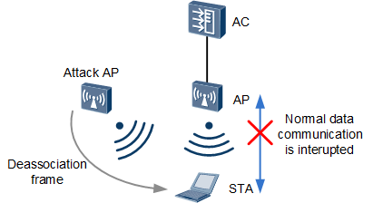

# Wi-Fi Deauthentication Attack

Denial-of-service (DoS) attack that stops the communication between a device and a Wi-Fi access point (AP). An attacker leverages  802.11 (Wi-Fi) **deauthentication frames** which are considered a notification insetead of request; thus, an 802.11 compliant device must deauthenticate upon recieving a **deauthentication frame**. In 2009, the [802.11w](https://en.wikipedia.org/wiki/IEEE_802.11w-2009) amendment was introduced; a major security improvement of this amendment is that some management frames, inluding **deauthentication frames**, can be protected using exsisting message integrity and data origin authentication mechanisms. Wi-Fi implementations after this amendement was apporved (802.11ac/ax) are not vulnerable to this type of attack. Implementations of Wi-Fi versions prior to 2009 (802.11 g/n), however, reamin vulnerable but their widspread used continues, particulary in IoT devices.



# Running the Exploit

Setup the wirless interface to be in monitor mode:
```bash
sudo ./setup.sh
```
Discover what channel the target AP is broadcasting at:
```bash
sudo ./find_channel.sh <BSSID>
```
Using the information outputed from the command above, send deauthentication packets to **all** clients or target specific ones:
```bash
sudo ./deauth_attack.sh <channel> <BSSID> [<client MAC(s)>]
``` 
Note that the ```<client MAC(s)>``` is an optional argument to target one or more MAC addresses; if none are given then all client are deauthenticating (i.e., deauth packets are sent to broadcast address). 

# Software Requirements
The attack depends the following open-source programs:
* [airmon-ng](https://www.aircrack-ng.org/doku.php?id=airmon-ng)
* [airodumo-ng](https://www.aircrack-ng.org/doku.php?id=airodump-ng)
* [aireplay-ng](https://www.aircrack-ng.org/doku.php?id=aireplay-ng)
* [Python 3](https://www.python.org/downloads/)

They all come pre-installed in [Kali Linux](https://www.google.com/url?sa=t&rct=j&q=&esrc=s&source=web&cd=&ved=2ahUKEwixh96T1cCEAxWMD1kFHfqeCmUQFnoECAYQAQ&url=https%3A%2F%2Fwww.kali.org%2F&usg=AOvVaw3j7AL-f4E1FDyRP_ygi8cR&opi=89978449) which is the OS used for the demo. 

# Harware Requirements
* An external Wi-Fi Network Adapter. We used an [Alfa AWUSO36NH](https://www.amazon.com/dp/B0035APGP6/?tag=whtnb-20). Note that this is **NOT** strictly necessary but becomes "handy'' to extend attack's range and keep internal Wi-Fi card for internet connection. 
* Some machine with the **software requiremnts** listed above. 
* Client(s)/device(s) wich supports 802.11 g/n **only**. For the demo we used [Kasa Smart Security Camera](https://www.amazon.com/Kasa-Security-Camera-Indoor-Wireless/dp/B08GH9KL4M/ref=asc_df_B08GH9KL4M/?tag=hyprod-20&linkCode=df0&hvadid=459717376558&hvpos=&hvnetw=g&hvrand=2855023455021916834&hvpone=&hvptwo=&hvqmt=&hvdev=c&hvdvcmdl=&hvlocint=&hvlocphy=9002419&hvtargid=pla-972628173746&psc=1&mcid=964b9e6e139b36be87c42c90f7e6da24&gclid=CjwKCAiA_tuuBhAUEiwAvxkgTg3cWfKW-f5Ghn7laV4-yYDRBsEEdyD6onURJT8ebJqUGx_mXF6UwxoCNT0QAvD_BwE)
* An access point that supports 802.11 g/n (most routers, raspberry pi, etc. will).